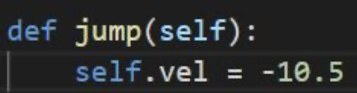

# Flappy Bird AI: NEAT

Esta es una implementación del algoritmo NEAT para vencer en el juego Flappy Bird.

[Mark Rivera](https://github.com/mriverre8) y yo la hicimos en su día como proyecto final para la asignatura de `Inteligencia Artificial` durante la carrera.

## Videos

- [Población = 15](https://youtu.be/ptPm1Ew6zV8?si=QGSeH5Q99OzUdbE_)
- [Población = 5](https://youtu.be/6PypyaRDlTo?si=RNgkB5GkyjTSF_3D)
- [Población = 100](https://youtu.be/LqmotYTgK9U?si=7LtQTXj1zRVLFJBx)

## Instalación

```bash
pip install -r requirements.txt
```

## Uso

```bash
python neural_network.py
```

# Documentación


Hecho por:
- [Jordi Bonet](https://github.com/jorbush)
- [Mark Rivera](https://github.com/mriverre8)

# Introducción

En este documento se explicarán los distintos apartados de nuestro proyecto, tanto en parte de código como de conceptos teóricos y prácticos.

Introduciendo al código de nuestra propuesta de tema del flappy bird, estas serán las pocas librerías que estaremos usando:

- **pygame**: Pygame es una biblioteca estándar de Python pensada y diseñada para juegos, que nos permite hacer cosas como crear pantallas o ventanas, jugar con sus atributos, dibujar cosas de colores y animar Sprites (es un tipo de mapa de bits dibujado en la pantalla de la computadora por hardware gráfico especializado) entre mil otras aplicaciones.
- **NEAT**: "Detallado más adelante"
- **time**: Es un módulo de la biblioteca estándar de Python, proporciona un conjunto de funciones para trabajar con fechas y/o horas.
- **os**: El módulo os permite acceder a funcionalidades dependientes del Sistema Operativo. Sobre todo, aquellas que nos brindan información sobre su entorno y nos permiten manipular la estructura de directorios (leer y escribir archivos...)
- **random**: Ofrece generadores de números pseudoaleatorios para varias distribuciones.

## ¿Qué es NEAT?
La neuroevolución (NE - la evolución artificial de redes neuronales que utiliza algoritmos genéticos), se ha mostrado muy prometedora en las tareas de aprendizaje por refuerzo. Las redes neuronales son una buena clase de sistemas de toma de decisiones para evolucionar porque son capaces de representar soluciones a muchos tipos diferentes de problemas.

Problemas a tratar si queremos una implementación eficiente siguiendo la metodología:

- Utilizar marcas históricas para alinear genes con el mismo origen.
- Separar cada innovación en una especie diferente.
- A partir de una estructura mínima y crecer sólo cuando sea necesario.

NEAT está diseñado específicamente para abordar estos tres desafíos y supera a los mejores métodos de ​topología​ fija.

Básicamente, NEAT es un algoritmo genético (GA) para la generación de redes neuronales artificiales en evolución, elabora gradualmente la estructura de una manera estocástica desde un punto de partida mínimo. Las estructuras más pequeñas se optimizan más rápido, por lo que NEAT puede encontrar soluciones más rápido que otros métodos de neuroevolución.

Altera tanto los parámetros de ponderación como las estructuras de las redes, intentando encontrar un equilibrio entre la idoneidad de las soluciones evolucionadas y su diversidad. Se basa en la aplicación de tres técnicas clave: rastrear genes con marcadores históricos para permitir el cruce entre topologías, aplicar la especiación (la evolución de las especies) para preservar las innovaciones y desarrollar topologías de forma incremental a partir de estructuras iniciales simples.

Cada genoma incluye una lista de genes de conexión. Cada gen de conexión específica: in-node (Input), out-node (Output), Activation Function (que nos dirá si se realiza una acción u otra), Population Size (cantidad de nodos a comparar), Fitness Function (Como vamos a crecer, sobre qué función nos basaremos para avanzar)... Estos son los básicos de NEAT.

*​topología​: ​Ciencia que estudia los razonamientos matemáticos

## Creando Flappy Bird con Pygame
Flappy Bird está compuesto por 3 tipos de objetos, un pájaro, distintas tuberías y un suelo. Para ello, en la implementación de este, incluiremos 3 clases, la clase Bird, la clase Pipe y la clase Base, cada una con sus debidas características y aplicaciones comentadas a continuación.

### bird.py
En este archivo se encuentra la implementación de la clase Bird para los objetos pájaro. Los métodos necesarios van a ser la acción de saltar del ave (​jump​), su movimiento para desplazarse (​move​), su máscara (​get_mask​) para calcular más adelante las colisiones con tuberías y dibujarlo.

Vamos a profundizar en cómo salta el ave:



Necesitamos establecer una velocidad negativa cuando saltamos porque el cuadrado marcado en la imagen tiene las coordenadas (0,0), lo que significa que para hacer que el pájaro dé un salto (el movimiento indicado con la flecha hacia arriba) tenemos que establecer un valor negativo.

Y si necesitamos ir hacia abajo, necesitamos establecer una velocidad positiva.

Ir hacia la izquierda o hacia la derecha es normal: positivo a la derecha, negativo a la izquierda.


### pipe.py
En esta clase, se introducirán las tuberías, así como la implementación de la capacidad que tiene una tubería de ser colisionada por un pájaro.

Una cosa que nos ha parecido relevante explicar detalladamente de esta clase es que para la colisión a las tuberías, utilizamos máscaras porque es más precisa que una colisión normal con cajas. Las máscaras funcionan de la siguiente manera: para cada imagen teníamos una lista de listas con valores de píxeles (10 columnas x 10 filas). Sabemos si dos imágenes tienen una colisión comparando su máscara, cada valor de píxel.


En cuanto a la parte de código sobre las colisiones, aquí tenemos el ejemplo de la comparación de las máscaras, para saber si estamos colisionando o no.

Obtenemos la máscara del pájaro y de las tuberías correspondientes, y calculamos la diferencia de los ejes (si estamos pasando una tubería, si el pájaro está por encima o debajo de la tubería), en resumen, miramos si dos píxeles se están solapando o no.

Una vez calculada la diferencia usando el .overlap() miramos si colisionan o no, (devolverá un valor booleano True o False según se solapen).


### base.py
Lo más remarcable de esta clase es como funciona el suelo. El suelo (​base​) tiene que ir hacia la izquierda para dar sensación de velocidad, por eso se utilizan dos suelos para que no se corte cuando llegue el momento. El problema viene cuando un suelo ha desaparecido por completo hacia la izquierda, entonces lo que se hace es volver a ponerlo a la derecha del segundo suelo, lo mismo para cuando se sale de la pantalla el segundo suelo, dando una sensación de suelo infinito.

Explicación visual:
La situación inicial son dos suelos que se mueven hacia la izquierda a con una velocidad de 5.


Al haber dos ​bases​/suelos, da la sensación de avance en la pantalla sin que se vea ningún corte (en la siguiente imagen si que se puede observar para distinguir los diferentes suelos).


Cuando una base ha salido completamente de la pantalla; es decir, su posición x1 más su anchura WIDTH es menor que cero (recordar que la esquina superior izquierda de la pantalla es la posición (0, 0)). Entonces, se pone el suelo que se ha salido de la pantalla, en nuestro caso el primer suelo, a la derecha del segundo, asignándole alaposiciónx1delprimerolaposicióndelfinaldelasegundabase,la posición x2 más su anchura WIDTH.


Esta operación nos deja en la misma situación inicial (solo que con las bases intercambiadas). Pasará exactamente lo mismo cuando la segunda ​base salga de la pantalla.


## Aplicando NEAT a Flappy Bird
### Definiendo nuestra Neural Network
Definamos nuestra red neuronal:

- Entrada: posición del eje Y del pájaro (solo la dirección puede mover el pájaro, saltando), posición del tubo superior y posición del tubo inferior.
- Salida: El pájaro salta o no salta.
- Función de activación: Usaremos la función TanH, la función tangente hiperbólica. Esta función nos permite reducir el valor que obtenemos de esta neurona de salida para que esté entre 1 o 1 negativo. Así que vamos a comprobar si el valor es mayor que 0,5, vamos a saltar, de lo contrario no.
- Tamaño de la población: 15 aves (no importa tanto). Cuántos pájaros tenemos corriendo cada generación. Comenzamos con la generación 0, tenemos cientos de aves, en este caso, que serán redes neuronales aleatorias, probamos todas estas aves y obtenemos lo mejor de ellas, las criamos, las mutamos y creamos otras cien aves en la próxima generación, generación. 1, y estos pájaros son un poco mejores y seguimos y seguimos.
- Función de aptitud: Cómo vamos a crecer realmente y cómo van a mejorar estas aves, para evaluar qué tan buenas son nuestras aves, para llevar lo mejor de ellas a la próxima generación. Nuestra función fitness será la distancia del pájaro. Un pájaro que ha avanzado más que otro es mejor.
- Max Generations: No hemos tenido suerte con las generaciones de aves, recuerda que las primeras aves son randoms, por lo que debemos poner un límite de generaciones. En nuestro caso habrá 40 generaciones como máximo.

Como se puede observar nuestra red neuronal tiene una estructura muy pequeña, lo que hará bastante sencilla su implementación y su progreso durante las generaciones.


#### Función de activación
La función de activación que utilizamos es TanH. Esta función se encarga de a partir de los inputs calcular su output con un valor entre 1 y -1. Los inputs en nuestro caso son la posición Y del ave, la distancia entre la posición Y del ave y la posición de la tubería de arriba (top) y, por último, la distancia entre la posición Y del ave y la posición de la tubería inferior (bottom); y a partir de estos valores aplicará la fórmula de la tangente hiperbólica para determinar si salta (output mayor que 0.5) o no salta.

TanH es una función matemática y trigonométrica. Se usa para devolver la tangente hiperbólica de un número.

La fórmula es entonces:
```
tanh x = sinh x / cosh x
```


En el siguiente esquema se puede observar su función en nuestra red neuronal:


#### Función de aptitud
Nuestra función ​fitness o de aptitud para nuestra red neuronal consiste en sumarle puntos a la función fitness de un gen porque el pájaro, con este gen, sobreviva y supere los obstáculos (tuberías) y restarle cuando el ave colisione. Es decir, en realidad esto se resume en cuanto más avance el ave, más distancia recorra, mejor valor de función ​fitness ​tendrá (ya que cuanto más avance más tiempo sobrevive y más tuberías supera, y por lo tanto más puntos tiene).

### Documento de configuración para NEAT
A continuación vamos a explicar los diferentes parámetros que damos, cuáles corresponden a GA (Genetic Algorithm) y cuáles a NN (Neural Network).

Nuestra red neuronal está definida, y configurada, en el archivo “config-feedforward.txt” y es en este archivo dónde encontramos los parámetros NN, para configurar el NEAT, nuestra red neuronal.

#### Neural Network (NN) y sus parámetros
A continuación, explicamos algunos de los parámetros NN más importantes del documento “config-feedforward.txt” que usaremos para configurar nuestra red neuronal:

activation_default = tanh → Función de activación por defecto

activation_mutate_rate = 0.0 → Si queremos cambiar la función de activación para que sea otra cosa aleatoriamente, puede cambiar este valor para que sea un X% de probabilidad de que cada vez que creemos un nuevo miembro de la población, obtenga una función de activación aleatoria diferente.

activation_options = tanh

\# network parameters

num_hidden = 0

num_inputs = 3 → Tenemos tres inputs; posición Y del ave, la distancia entre la posición Y del ave y la posición de la tubería de arriba (top) y, por último, la distancia entre la posición Y del ave y la posición de la tubería inferior (bottom).

num_outputs = 1 → Tenemos una única salida: si salta o no lo hace. Si el valor que devuelve la función de activación es mayor que 0.5 saltará, si no no, lo hará.

[DefaultSpeciesSet]

compatibility_threshold = 3.0 → Se considera que los individuos cuya distancia genómica es menor que este umbral pertenecen a la misma especie.

[DefaultStagnation]

species_fitness_func = max → La función utilizada para calcular la aptitud de las aves. Su valor predeterminado es “mean”

max_stagnation = 20 → Las aves que no hayan mostrado una mejora en más de este número de generaciones se considerarán estancadas y eliminadas. Este valor predeterminado es 15.

species_elitism = 2 → El número de aves que se protegerán del estancamiento, el ajuste de 3 evitará que las 3 aves con la mayor aptitud de especie sean eliminadas para el estancamiento, independientemente de la cantidad de tiempo que no hayan mostrado mejora. Este valor predeterminado es 0.

[DefaultReproduction]

elitism = 2 ​→ El número de aves que estarán protegidas del estancamiento; destinado principalmente para evitar las extinciones totales causadas por el estancamiento de todas las aves antes de que surjan nuevas. Por ejemplo, una configuración de elitismo de 3 evitará que las 3 aves con la mayor aptitud de especie se eliminen por estancamiento independientemente de la cantidad de tiempo que no hayan mostrado una mejora. Este valor predeterminado es 0.

survival_threshold = 0.2 → La fracción de cada ave que permite reproducir cada generación. Este valor predeterminado es 0.2.

### Algoritmo Genético (GA) y sus parámetros
Una vez ya hemos definido nuestros parámetros NN para nuestra red neuronal vamos a definir los parámetros GA de nuestro algoritmo genético.

Primero de todo, definimos nuestro algoritmo genético.

Los algoritmos genéticos tienen la finalidad de, en un espacio de posibles soluciones, encontrar una que resuelva el problema. Los algoritmos genéticos son algoritmos de búsqueda estocástica que actúan sobre una población de posibles soluciones, en nuestro caso un número (15) de pájaros. Se basan libremente en la mecánica de la genética y la selección de poblaciones. Las posibles soluciones están codificadas como "genes": cadenas de caracteres de algún alfabeto. Estos genes, cada uno corresponde a una ave de cada de generación (de cada genoma), los almacenamos en la lista “gen” al coger el nuevo genoma de la generación:


En nuestro caso, cada gen se evalúa según su función fitness. Recordemos que nuestra función fitness es mejor en función de que el pájaro sobreviva, lo cuál está implementado a continuación:


Pero en cambio, si colisiona con una tubería y no sobrevive se le penaliza en la función fitness y de hecho eliminamos el genoma:


Si el ave supera las tuberías se le recompensa como se merece:


Se pueden producir nuevas soluciones "mutando" a los miembros de la población actual y "emparejando" dos soluciones para formar una nueva solución. En la primera generación (la generación 0) es aleatoria (por eso influye tanto la población que usemos: cuanto mayor sea la muestra, mayor probabilidad de obtener un pájaro aleatorio bueno) y a partir de esta se cogen las mejores aves y se mutan entre ellas. Las mejores soluciones se seleccionan para reproducirse y mutar y las peores se descartan. Como hemos mencionado depende de la probabilidad; es decir, son métodos de búsqueda probabilísticos; esto significa que los estados que exploran no están determinados únicamente por las propiedades de los problemas. Un proceso aleatorio ayuda a guiar la búsqueda, por eso es que la primera generación lo és.

### neural_network.py
Primero cogemos los datos que nos interesan del documento de configuración de NEAT (explicado en el apartado anterior) y lo hacemos nada más ejecutar neural_network.py (`if __name__ == "__main__"`), dónde llamamos a `run_NEAT()` para ejecutar la red neuronal con la configuración establecida. Dentro de esta función se llama en el número máximo de generaciones; es decir, 40 veces, a la función `new_generation()`, dónde se ejecuta una generación de aves. En `new_generation()`, se obtienen los genomas, las redes neuronales, se crean los pájaros y se inicializan las variables que usaremos. Cada generación tiene un color aleatorio diferente. Una vez estamos en el game loop, en cada iteración, se miran los pájaros que están vivos: se aumenta su función fitness y se determina su output a través de la función activación entrandole los inputs definidos anteriormente. Después se mira las colisiones con las tuberías, si colisiona, se penaliza en la función fitness, y se elimina el genoma (de todas las listas). en cambio si pasa se recompensa sumándole 5 puntos a la función fitness de los genomas que han superado la tubería. También se elimina si el pájaro sale de la pantalla por arriba o colisiona contra el suelo. Se mira si se ha llegado ya a la meta, en cuyo caso se finaliza la generación. Finalmente se actualiza la información que hay por pantalla.


### Resultados
Si modificamos el tamaño de población en el documento de configuración del NEAT, cambia bastante el resultado. Esto es porque si por ejemplo utilizamos 100 aves como tamaño de población, en la primera generación, la generación cero, donde las aves tienen un comportamiento muy aleatorio, al ser 100 hay una probabilidad bastante grande de que por casualidad el gen de alguna de estas aves sea bueno y supere con facilidad los obstáculos (si no lo consigue en esta lo consigue en pocas generaciones más, ya que recordemos que cada generación pilla lo mejor de la generación anterior, excepto la primera que es aleatorio). Trabajar con valores tan altos de tamaño no nos interesa, ya que nos interesa ver su evolución a través de las generaciones y en la “selección natural”. Por eso pensamos que el valor perfecto para ver esta evolución es 15 aves (o cualquier valor entre 20 y 10), ya que no siempre consigue llegar a la meta (las generaciones no consiguen alcanzar el threshold mínimo establecido en el documento de configuración del NEAT y no merece la pena seguir con estas generaciones porque simplemente hemos tenido mala suerte con sus genes; o también porque hemos superado el máximo de generaciones creadas) y tarda bastantes generaciones en llegar a ella en el caso que lo haga. Si usamos una población menor de 10, es complicado llegar a la meta, ya que tendríamos mucha menos probabilidad de que los valores aleatorios iniciales de la generación cero sean buenos.

Hemos grabado estas pruebas, a continuación están los enlaces a sus videos: · Con población 100: ​[Video](https://youtu.be/LqmotYTgK9U) · Con población 15: ​[Video](https://youtu.be/ptPm1Ew6zV8) · Con población 5: ​[Video](https://youtu.be/6PypyaRDlTo)

### Conclusión
Finalmente, realizando este proyecto, hemos descubierto distintas metodologías a seguir en relación a la Inteligencia Artificial, NEAT en este caso. Podemos llegar a la conclusión de que hay varios tipos de una implementación de IA y que no solo hemos de cerrarnos al contenido teórico de las aulas asíncronas de teoría, si no que hay mil tipos de información e implementaciones que pueden ser utilizadas a pesar de ser más complejas.
También hemos hecho uso de librerías de python que desconocíamos, como por ejemplo pygame, y que hemos visto que son clave a la hora de diseñar un videojuego del estilo.

### Comentarios adicionales
En un principio teníamos pensado aplicar los diferentes algoritmos de búsqueda, tanto informada como no informada, a Flappy Bird. Pero, como consecuencia de no tener unos estados definidos, un ​GameState como en las prácticas con Pac-man, no ha sido posible. Además de que tampoco tendría mucho sentido ya que (a diferencia del pac-man que puede ir hacia arriba, hacia abajo, hacia la derecha y hacia la izquierda) este solo tiene una posible acción que es saltar.
También hemos encontrado mucho soporte en internet sobre este tema aplicado en este juego, y NEAT nos ha parecido un tema muy interesante.

### Ejecución del código
El código se ejecuta ejecutando el archivo neural_network.py. Las pruebas se han realizado con python 3.7.9.
Se requiere instalar las librerías de Pygame y Neat:
- `pip install pygame`
- `pip install neat-python`
